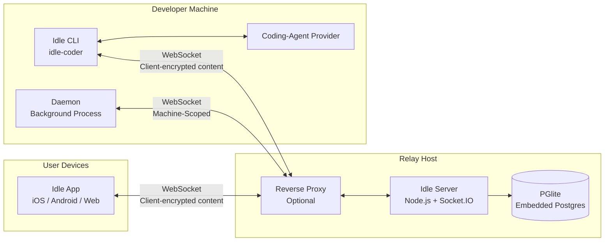

# Idle architecture

## Public components

| Component | Role |
|---|---|
| Idle app | Expo client for iOS, Android, and the web |
| `idle-coder` | Interactive coding-agent CLI and local machine daemon |
| `@northglass/agent` | Non-interactive control client for an authenticated Idle account |
| `@northglass/idle-server` | Fastify HTTP API, Socket.IO relay, and persistence |
| `@northglass/idle-wire` | Shared schemas and wire types |

The web client is available at [idle.northglass.io](https://idle.northglass.io).
The public architecture describes product interfaces rather than a particular
operator's hosts, network layout, or release process.

## System Overview



## Traffic flow: CLI → relay → app

This diagram traces what happens when a user runs `idle` and views the session
in an authorized Idle app.

### 1. CLI Startup

```
$ idle
  │
  ├── Check if daemon is running (read daemon.state.json)
  │   └── If not: spawn `idle daemon start-sync` (detached background process)
  │       Daemon connects to server as machine-scoped WebSocket client
  │       Daemon runs HTTP control server on localhost:random for local IPC
  │
  ├── Generate 32-byte SESSION KEY (crypto random, unique per session)
  │   Wrap session key with user's PUBLIC KEY (ephemeral NaCl public-key box)
  │
  ├── POST /v2/sessions to server
  │   Body: { id, tag, metadata (encrypted), dataEncryptionKey (encrypted key blob) }
  │   Server stores encrypted key blob — cannot unwrap it
  │
  ├── Open WebSocket to the configured Idle relay
  │   Auth: { token, clientType: 'session-scoped', sessionId }
  │
  └── Start the selected coding-agent process
      Provider adapter translates its events into the Idle session protocol
      Session output is encrypted by the CLI before relay transport
```

### 2. Message Relay (CLI → Server → App)

```
TERMINAL                          SERVER                           IDLE APP
────────                          ──────                           ──────

Coding agent generates output
"Here's the fix..."
        │
        ▼
CLI encrypts with SESSION KEY
AES-256-GCM(plaintext) → base64
        │
        ▼
Socket.IO emit('message', {
  sid: "session-123",
  message: "aW4gR29k...",        Server receives blob
  localId: "uuid"           ───▶  │
})                                │  ❌ Cannot decrypt
                                  │  Stores { t:'encrypted', c:'aW4g...' }
                                  │
                                  │  eventRouter broadcasts to
                                  │  all user-scoped connections
                                  │                                    │
                                  └──── Socket.IO 'update' event ────▶│
                                                                      │
                                                            Look up session key
                                                            (decrypted at app startup)
                                                                      │
                                                            AES-256-GCM decrypt
                                                                      │
                                                            Renders: "Here's the fix..."
```

### 3. App → CLI (Permissions, Messages)

The reverse flow — when you approve a permission request or send a message from
an authorized app:

```
IDLE APP                          SERVER                          TERMINAL
──────                            ──────                          ────────

User taps "Approve"
        │
Encrypt with SESSION KEY
        │
socket.emit('rpc-call', {
  method: 'session-123:         Routes encrypted RPC
    approve-permission',   ───▶  to CLI's WebSocket    ───▶  CLI decrypts
  params: encrypt({                                           and validates
    kind: 'idle-rpc-request',                                 request identity,
    v: 1, scope, method,                                      route, freshness;
    requestId, issuedAt,                                      Provider gets
    params: { ... }
  })
})                                                            permission
                                                              and runs
```

### 4. Key Exchange (How an Authorized Client Gets the Session Key)

The session key never travels in plaintext. The server stores an encrypted blob it cannot open.

```
CLI                              SERVER                          IDLE APP
───                              ──────                          ──────

Generate sessionKey
(32 random bytes)
        │
Wrap with user's
PUBLIC KEY
(ephemeral NaCl public-key box)
        │
POST /v2/sessions ──────▶ Store encrypted blob
  { dataEncryptionKey:     as-is in database
    [version|ephPubKey|nonce|
     ciphertext] }
                                                        GET /v1/sessions
                           Return encrypted blob ──────▶ │
                                                         Decrypt with
                                                         PRIVATE KEY
                                                         (from client account secret
                                                          in platform secure storage)
                                                                │
                                                         sessionKey recovered!
                                                         Cached in memory
        │                                                       │
        └───────── Encrypted messages flow both ways ───────────┘
                   Server relays but cannot read them
```

### 5. Daemon Architecture

The daemon is a long-lived background process that outlives individual CLI sessions:

```
┌─ Developer Machine ────────────────────────────────────────┐
│                                                            │
│  idle daemon start-sync (background, detached)             │
│  │                                                         │
│  ├── HTTP Control Server (localhost:random)                 │
│  │   ├── POST /session-started (CLI notifies daemon)       │
│  │   ├── POST /spawn-session (app requests new session)    │
│  │   ├── POST /stop-session (app stops a session)          │
│  │   ├── POST /list (enumerate active sessions)            │
│  │   └── POST /stop (graceful shutdown)                    │
│  │   Auth: Bearer token (random, stored in daemon.state)   │
│  │                                                         │
│  ├── WebSocket to server (machine-scoped)                  │
│  │   Receives RPC: "spawn session in /path/to/project"     │
│  │   from authorized app → daemon starts new CLI process   │
│  │                                                         │
│  └── Session Tracker                                       │
│      Tracks PIDs of child idle processes                   │
│      Health checks, orphan cleanup                         │
│                                                            │
│  idle (session 1) ← runs a coding-agent process            │
│  idle (session 2) ← runs a coding-agent process            │
│  idle (session 3) ← ...                                    │
└────────────────────────────────────────────────────────────┘
```

## What the Server Sees vs. Cannot See

| Data | Encrypted? | Server Can Read? |
|------|-----------|-----------------|
| Message content | AES-256-GCM | **No** — opaque blobs |
| Session metadata (title, summary) | AES-256-GCM | **No** |
| Coding-agent state | AES-256-GCM | **No** |
| Legacy GitHub OAuth token | Server-side encryption at rest | **Yes** — the server can decrypt it for provider revocation during disconnect |
| Session tag (name) | No | Yes — e.g., "coding session #3" |
| Session ID | No | Yes — opaque UUID |
| User account ID | No | Yes — opaque identifier |
| Message sequence numbers | No | Yes — ordering only |
| Timestamps | No | Yes |
| Which machine a session runs on | No | Yes — machine ID |

See [encryption.md](encryption.md) for the full cryptographic specification.

## Package Dependencies

```mermaid
graph TD
    WIRE[@northglass/idle-wire<br/>Shared Zod types]
    CLI[idle-coder<br/>CLI]
    APP[idle-app<br/>Mobile + Web]
    SRV[idle-server<br/>API Server]
    AGENT[@northglass/agent<br/>Agent CLI]

    CLI --> WIRE
    APP --> WIRE
    SRV --> WIRE
    AGENT --> WIRE
    CLI --> PROVIDERS[Coding-agent adapters]
```

## Deployment Boundary

The public system consists of an Expo client, the `idle-coder` CLI, the
programmatic Agent, a Fastify/Socket.IO relay, and the relay's default PGlite data
store. Operator host layout, access controls, release identities, and procedures
are intentionally outside this public architecture contract.

Self-hosters choose their own TLS termination, network exposure, process
isolation, storage, and backup controls. The packaged server defaults and
supported deployment patterns are documented in
[SELF-HOSTING.md](SELF-HOSTING.md).
