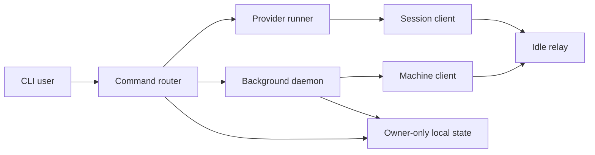
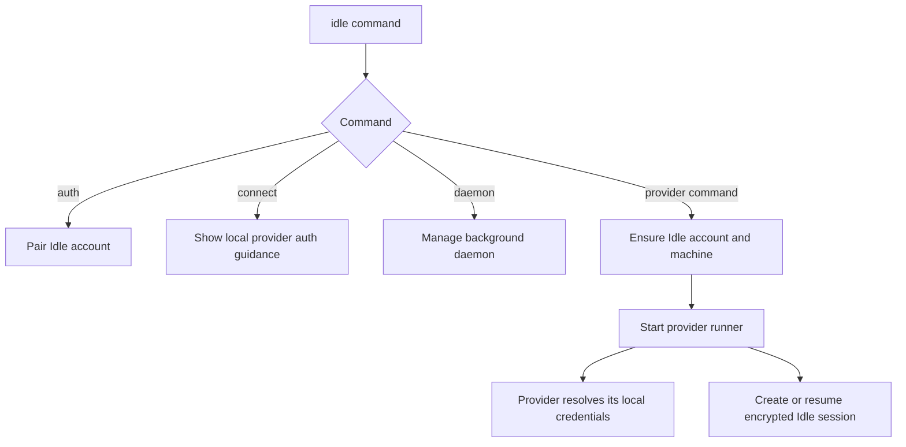
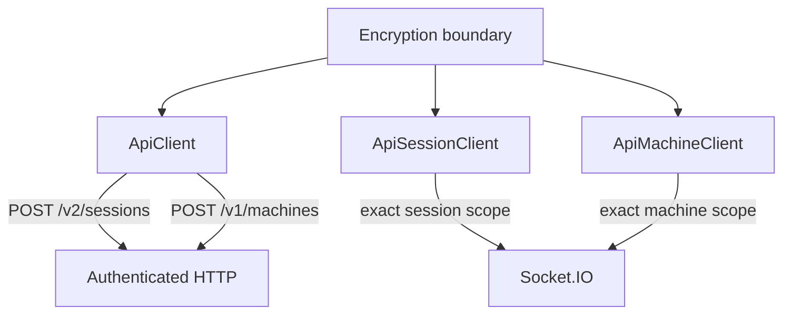
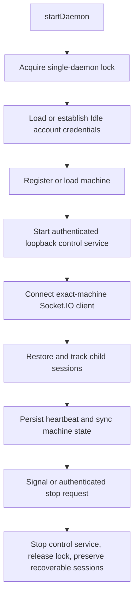
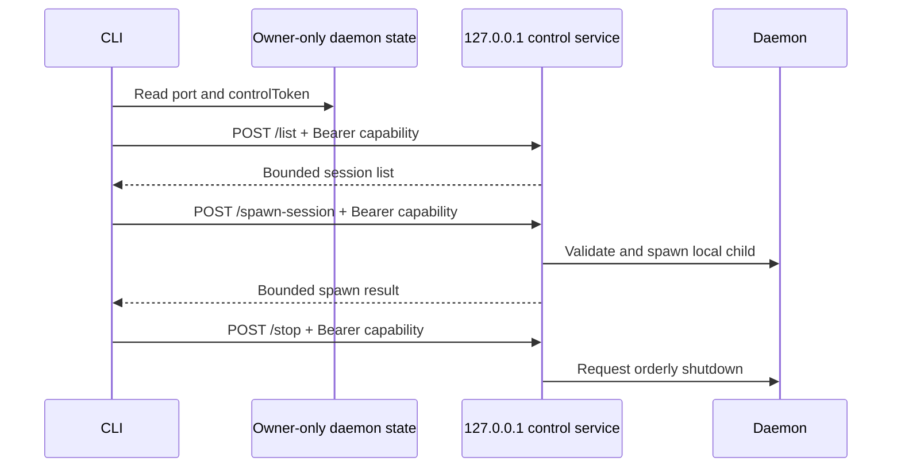
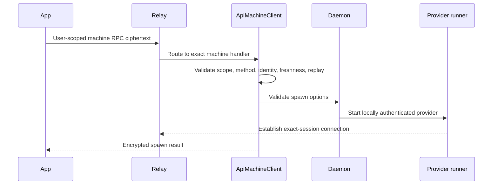

# CLI architecture

The Idle CLI (`packages/idle-cli`) runs supported coding agents, maintains the
encrypted session connection, and optionally keeps a background daemon
available for remote session launch.

## Responsibilities

- `src/index.ts` parses commands and provider options.
- `src/api` implements authenticated HTTP, scoped Socket.IO connections,
  end-to-end encrypted fields, and encrypted RPC.
- `src/daemon` owns background session launch, machine presence, and the
  authenticated loopback control service.
- `src/persistence.ts` and `src/configuration.ts` manage owner-only local state.
- `src/claude`, `src/codex`, `src/gemini`, `src/openclaw`, and `src/agent/acp`
  adapt provider-specific protocols to the shared Idle session model.

## Command and authentication boundaries

The default `idle` command runs Claude. `idle codex`, `idle gemini`, `idle
openclaw`, and `idle acp` select other supported runners. `idle resume` resumes
an Idle session, while `idle daemon`, `idle doctor`, `idle sandbox`, and `idle
server` manage their respective local services.

Idle account authentication and coding-provider authentication are separate:

- `idle auth login` pairs the CLI with an Idle account and establishes the
  account and encryption credentials used with the relay.
- Idle launches official provider CLIs or local SDK integrations. Provider
  credentials stay local to the machine and are never sent to the Idle relay.
  Sandboxed Codex accepts an explicit access token or API key through supported
  Codex interfaces and runs with a disposable runtime home. A consumer ChatGPT
  login cannot cross that boundary through a supported public interface;
  `idle codex --no-sandbox` explicitly runs against the official CLI's normal
  Codex home and login instead.
- `idle connect` is local provider-authentication guidance, not a credential
  upload command. `idle connect gemini` explains the supported local Gemini
  options. Claude users sign in with `claude`; Codex users run `codex login`.
- Remote spawn selects a provider and starts the already-authenticated local
  tool. The supported app flow does not send a Claude, Codex, or Gemini
  credential.
- Explicit child-process environment overrides are an advanced full-control
  capability. Their keys, values, count, and aggregate size are bounded and
  validated, but they are not a provider-credential vault. Provider
  authentication remains in the provider's local configuration.

## Local state

The default state directory is `~/.idle`; `IDLE_HOME_DIR` selects an isolated
alternative. Important files are:

| Path | Purpose | Protection |
| --- | --- | --- |
| `settings.json` | Validated CLI settings and machine registration state | Regular owner-only file |
| `access.key` | Idle account and encryption credentials | Regular owner-only file |
| `daemon.state.json` | Local daemon PID, loopback port, version, and `controlToken` | Atomic regular owner-only file |
| `sessions.json` | Bounded background-session recovery metadata | Atomic regular owner-only file |
| `logs/` | Bounded, sanitized local diagnostics | Owner-only directory and files |

`IDLE_SERVER_URL` and `IDLE_WEBAPP_URL` override the relay and web-app origins.
`IDLE_VARIANT`, `IDLE_EXPERIMENTAL`, and `IDLE_DISABLE_CAFFEINATE` control local
runtime behavior. Secret values should be supplied through an appropriate
local credential store or process environment and must not be committed.

The relay origin passes through the same shared policy as Idle Agent: it must
be a bounded credential-free HTTPS origin, except that plain HTTP is accepted
for a genuinely loopback client endpoint. Invalid environment or settings
values abort configuration before authenticated HTTP or Socket.IO starts.

## Relay clients

`ApiClient` performs account-authenticated HTTP operations. The current create
paths are:

- `POST /v2/sessions` for idempotent session creation with encrypted metadata,
  agent state, and wrapped data-key material.
- `POST /v1/machines` for machine registration with encrypted metadata and
  daemon state.

Account-bearer HTTP calls disable redirects. A redirect response is surfaced
without forwarding `Authorization` to another origin or a cleartext downgrade.

After creation, scoped Socket.IO clients carry realtime state:

- `ApiSessionClient` authenticates for exactly one session. It receives
  encrypted updates and emits session messages, metadata/state updates,
  presence, and bounded usage snapshots.
- `ApiMachineClient` authenticates for exactly one machine. It emits machine
  presence and encrypted machine state, receives machine updates, and
  registers that machine's RPC handlers.

Session messages, session metadata/state, and machine metadata/state are
encrypted on the client before transport. Wrapped per-record keys allow paired
clients to decrypt those fields without giving the relay their plaintext.
Protocol and server-readable exceptions are documented in
[Encryption](./encryption.md) and [Security](./SECURITY.md).

## Daemon lifecycle

The daemon provides machine presence and remote launch while the interactive
CLI is not running.

The daemon keeps its local heartbeat state separate from encrypted machine
state sent to the relay. In particular, the loopback `controlToken` is retained
only in the local daemon state file and is not machine metadata.

## Authenticated loopback control service

`startDaemonControlServer()` binds an ephemeral port on `127.0.0.1`. Every
route uses `POST` and requires `Authorization: Bearer <controlToken>`. The
client obtains the port and capability from the owner-only daemon state file;
possession of a live PID alone is never treated as daemon identity.

The routes are:

- `/list` — list daemon-tracked sessions.
- `/stop-session` — stop one tracked child.
- `/spawn-session` — start a child from a bounded validated request.
- `/session-started` — let a foreground session report its authenticated
  session metadata to the daemon.
- `/stop` — request daemon shutdown.

The control client disables redirects, bounds response bodies, and verifies
that shutdown responses identify the same process recorded in the state file
before any signal is sent.

## Remote session spawn

A paired app sends a fresh encrypted RPC request to the selected machine. The
relay routes ciphertext to the exact machine-scoped socket; it does not call
the loopback service.

The authenticated plaintext inside the encrypted RPC envelope binds
`scope`, `method`, `requestId`, `issuedAt`, and `params`. The receiver consumes
the request identity in an owner-only durable replay store before invoking a
handler. Spawn options include the working directory, provider, permission
to create a missing directory, bounded child-process environment overrides,
and optional resume/fork coordinates. The protocol has no dedicated provider
credential field.

## Session RPC surface

Each running session registers handlers under its exact session prefix. The
shared surface includes shell execution, Git diff, existing-file read/write,
and bounded workspace file listing. Provider runners add permission, abort,
mode, goal, and provider-specific controls.

Security boundaries are enforced before execution:

- The connection scope and authenticated inner route must match the exact
  session or machine.
- Request identities have bounded age and future skew and cannot be replayed.
- Paths are constrained to the session workspace and opened without following
  an attacker-controlled final symlink.
- Child-process arguments use argv boundaries where supported; shell commands
  are an explicit user-facing RPC rather than an implementation shortcut.
- Inputs and outputs have fixed size limits, and malformed failures are mapped
  to bounded diagnostics.

## Incoming message replay boundary

Socket delivery and HTTP catch-up converge on one decrypted-message boundary.
For user prompts and file events, the CLI verifies the authenticated session
and message identity (or derives a legacy ciphertext fingerprint), combines it
with a digest of the session key epoch, and atomically creates an owner-only
digest marker before calling a provider adapter. A new process opens the same
ledger, so a relay cannot make a consumed instruction fresh by restarting the
CLI, rewrapping the row, changing sequence metadata, or aging a memory cache.
Concurrent consumers receive at most one successful consumption result.

Markers are intentionally retained for the session key epoch because message
ciphertext has no authenticated expiry. The per-epoch bound rejects new work
when full rather than deleting an older marker. Missing anchored state,
unexpected entries, symlinks, ownership mismatches, and I/O errors also fail
closed before provider-visible work.

## Provider adapters

All adapters publish the same encrypted Idle session model while preserving
provider-specific behavior:

- Claude supports local and remote modes through the official Claude Code
  runtime.
- Codex uses the local Codex app-server protocol.
- Gemini uses the local Gemini integration.
- OpenClaw connects to a configured local or user-selected gateway.
- ACP runs a supported built-in agent or an explicit custom ACP command.

Permission prompts remain the default. Explicit bypass flags such as `--yolo`
and `--dangerously-skip-permissions` are provider features selected by the user;
remote launch does not enable them implicitly.

## Implementation references

- CLI router: `packages/idle-cli/src/index.ts`
- API clients: `packages/idle-cli/src/api`
- Daemon and loopback control: `packages/idle-cli/src/daemon`
- Spawn request schemas: `packages/idle-cli/src/daemon/spawnSessionOptions.ts`
- RPC handler registration: `packages/idle-cli/src/modules/common/registerCommonHandlers.ts`
- Local persistence: `packages/idle-cli/src/persistence.ts`
- Configuration: `packages/idle-cli/src/configuration.ts`
